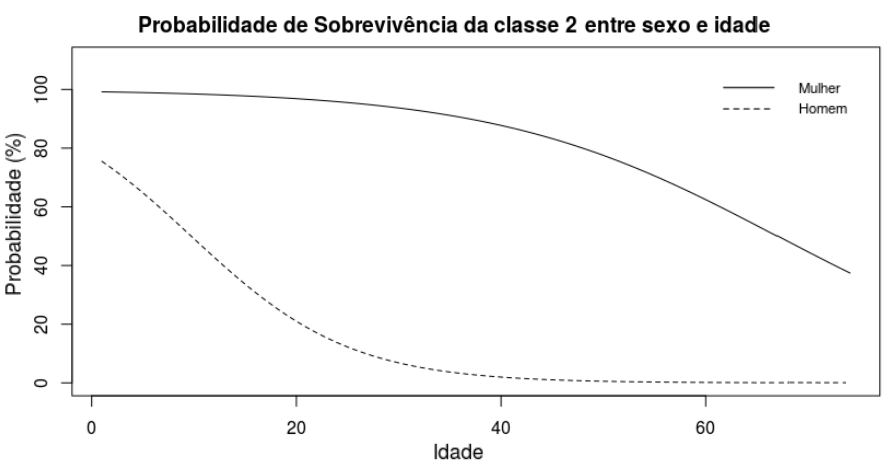

# Titanic 

Os dados do Titanic são amplamente utilizados em análises de dados e estudos de modelagem. O conjunto de dados inclui informações sobre 891 passageiros do navio, incluindo idade, sexo, classe social, taxa de sobrevivência e outras variáveis.

A regressão logística objetiva modelar o comportamento de uma
variável binária condicionada a variáveis explicativas através de uma estrutura regressiva que
permite estimar a probabilidade de ocorrência do evento de interesse. Esse modelo classifica-se
como um caso particular dos MLGs sendo que a distribuição da variável de interesse (binomial)
pertence à família de distribuições exponencial.  Sua flexibilidade encontra-se na relação funcional entre a média de $\boldsymbol{y}$ e o preditor linear  que pode ser arbitrada pela função de ligação, garantindo que o parâmetro a ser modelado
não possua valores fora do seu espaço paramétrico. 

Seja \textit{Y} uma variável aleatória com distribuição de Bernoulli onde $p_i$ é a probabilidade de  ocorrência de sucesso $\mathbb{P}(Y=1)$ ou fracasso $\mathbb{P}(Y=0)$. Sua função de probabilidade é dada por

$$
f(y_i) = \mathbb{P}(Y=y_i) = p_i^{y_i} (1-p_i)^{1-y_i}, \quad y_i=0,\,1, \quad 0 \leq p_i \leq 1. % = P(y_i=y)
$$

A média e a variância de $y_i$ são, respectivamente, 

$$
\boldsymbol{E}(y_i)=p_i,\quad
\text{Var}(y_i) = p_i\,(1-p_i).
$$

Os MLGs são constituídos pela componente aleatória, componente sistemática e a função de ligação $g(\cdot)$ monótona e diferenciável:

$$
g\left( p_i  \right) = \boldsymbol{\eta} =  X\boldsymbol{\beta},  
$$

em que  \textit{X} é a matriz $n\times k$ de covariáveis,  $\boldsymbol{\beta}=(\beta_1,\ldots,\beta_k)^\top$ é o $k$-vetor de parâmetros, %(como na regressão linear)
a componente sistemática 
é a soma linear dos efeitos $\boldsymbol{x}_i^\top \boldsymbol{\beta}$ das covariáveis e a função de ligação $g(p_i)$ 
relaciona a probabilidade de sucesso com o preditor linear. 


A regressão logística considera a função de ligação logit, expressa por

$$
g(p_i) = \log\left( \frac{p_i}{1-p_i} \right). %\eta_i
$$

Ela restringe a média de $y_i$ no intervalo unitário e relaciona aos preditores que variam no conjunto dos reais. Neste caso, a ligação logit ainda possui conveniências estatísticas, pois é uma função de ligação canônica onde o preditor linear modela diretamente o parâmetro canônico.
O modelo tem uma formulação equivalente a 

$$ p_i = \frac{1}{1+\exp(-\eta_i)}.$$

Analogamente, alguns autores escrevem
$$p_i=\frac{\exp(\eta_i)}{1+\exp(\eta_i)}.$$

Neste trabalho foi utilizada a regressão logística para modelar a probabilidade de sobrevivência dos tripulantes a partir de suas idades, sexo, classe. A modelagem dos dados do Titanic envolveu a utilização de técnicas de análise exploratória, limpeza de dados, transformação e criação de novas variáveis. A análise de diagnóstico foi realizada com envelopes simulados dos resíduos e seu comportamento, alavancagem, DFFIT, distância de Cook, teste RESET (para validar a função de ligação) e pseudo R2. Para mais detalhes, acesse o arquivo abaixo:

[Arquivo pdf - Modelagem MLG Titanic](TitanicRMD.pdf)

Uma função para aplicação do modelo final é apresentada abaixo.
``` r
survive<- function(Sexo, Idade, Classe)
{  
  SEX <- Sexo # Feminino: 1 , Masc:0
  AGE <- Idade
  CLASSE <- Classe
  if(CLASSE == 1){
    C1<-1
    C2<-0
  } 
  else if(CLASSE == 2){
    C1<-0
    C2<-1
  }
  else if(CLASSE == 3){
    C1<-0
    C2<-0
  }
  else print(c("Classe Incorreta. Utilize classe 1, 2 ou 3"), quote = F)
  
  Int1 = SEX*C1
  Int2 = SEX*C2
  Int3 = AGE*C2
  
  g = -0.8686 + 1.4597*(SEX) -0.0349*(AGE) +1.8199*(C1) +1.7522*(C2) +2.2073*(Int1) +3.9433*(Int2) -0.076*(Int3)
  Eg <- (exp(g))/(1+exp(g))
  prob <-round(Eg,3)
  CH <- round(Eg/(1-Eg),3)
  
  print(c("Sua probabilidade de sobrevivência é de", prob), quote = F)
  
  if(CH >= 1) print(c("E sua chande de sucesso é de", CH, "vezes maior!"),quote = F)
  else print(c("E sua chance de sucesso é de", CH, "vezes menor!"), quote = F)
}
```
Por exemplo, para obter a minha probabilidade de sobrevivência estando na primeira classe:

> survive(Sexo=0, Idade=22, Classe=1)
> 
> Sua probabilidade de sobrevivência é de 0.546
> 
> E sua chance de sucesso é de 1.201 vezes maior! 

E se eu estivesse na terceira classe?
> survive(Sexo=0, Idade=22, Classe=3)
> 
> Sua probabilidade de sobrevivência é de 0.163 
> 
> E sua chance de sucesso é de 0.195 vezes menor! 

Calculando a razão de chances (explicada abaixo)  $\frac{1.201}{0.195}=6.1$ conclui-se: a chance de eu sobreviver na primeira classe é **6** vezes maior do que na terceira classe para um mesmo indíviduo homem de 22 anos.

A interpretabilidade dos parâmetros baseada na razão de chances de probabilidades (\textit{Odds Ratio} - OR) é uma vantagem de ajustar uma regressão logística. É uma medida importante para mensurar a força de associação entre as variáveis ao comparar a chance de sucesso de uma determinada característica $p_i^*$ em relação a outra $p_i$. Obtemos OR, aplicando a função exponencial diretamente nos coeficientes do modelo, como segue, 

$$
\text{OR}(x_1+1,x_1) = \frac{p_i^* \text{/}(1-p_i^*)}{p_i\text{/}(1-p_i)}  = \exp(\widehat{\beta}_1)
$$

isto é, a chance do evento ocorrer entre indivíduos que diferem em uma unidade na variável $x_1$ é igual a $\exp(\widehat{\beta}_1)$. Generalizando, para quantificar a alteração da chance de ocorrência de um evento após $c$ incrementos unitários, utiliza-se $\exp(c\,\widehat{\beta}_1)$.

Como exemplo ilustrativo, um gráfico é plotado de acordo com o modelo estimado para apresentar a variação da probabilidade de sobrevivência dos indivíduos conforme alteramos a idade de homens e mulheres na segunda classe.
<p align="center">
  
</p>
